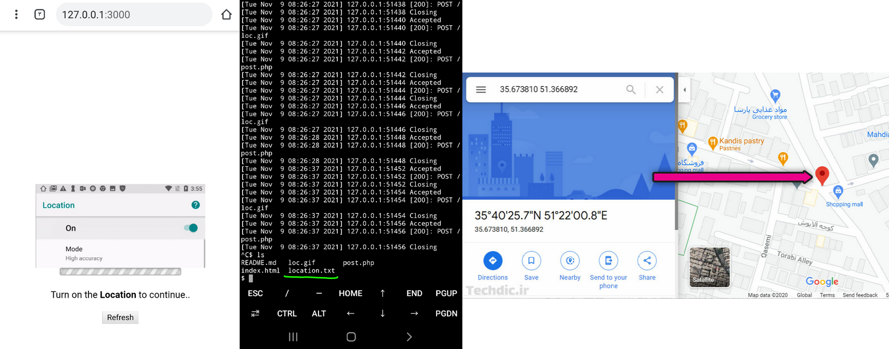
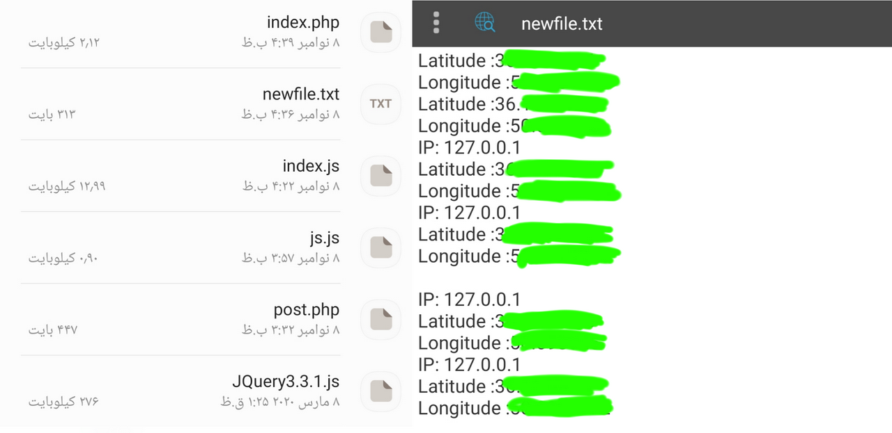

# hacklocation
<b>
Hack location by send link - هک لوکیشن با ارسال لینک - هک موقعیت مکانی قربانی با ارسال لینک 
<b>

  <h3>
  در این آموزش به دو روش میتونید این کار رو انجام بدید
</h3>

 
<b>
:روش اول با استفاده از ترموکس و لینوکس
</b> 
ابتدا وارد ترموکس بشید و با دستور زیر اسکریپت رو دانلود کنید
 <pre>
git clone https://github.com/HACKGM/hacklocation
</pre>
سپس با دستور زیر وارد پوشه اسکریپت بشید:
 <pre>
cd hacklocation
</pre>

 ،سپس در مسیری که هستید لوکال هاست رو اجرا کنید و با پورت فرواردینگ برای اسکریپت لینک بسازید و لینک رو به قربانی بدید
  

    <b>
      <a href="https://telegra.ph/%D8%B1%D9%88%D8%B4-%D9%87%D8%A7%DB%8C-%D8%A7%D8%AC%D8%B1%D8%A7%DB%8C-%D9%BE%D8%B1%D9%88%D8%AA-%D9%81%D8%B1%D9%88%D8%A7%D8%B1%D8%AF%DB%8C%D9%86%DA%AF-2021-11-06" > آموزش پورت فرواردینگ</a>
     </b> </a>
  

 <b>
بعد از کلیک کردن قربانی روی لینک موقعیت مکانیش در فایلی به نام 
   
  location.txt 
  
      ذخیره میشود
  </b>
   
  ______________________
  <h3>
:روش دوم با استفاده از هاست و دامنه
</h3>
 
:ابتدا سورس را از لینک زیر دانلود و استخراج کنید
 
<a href="https://www.mediafire.com/file/kde16po31byh3aa/location_free_script.zip/file">Link Download Script Hack location Free</a>

 
 <b>
    سپس سورس را در هاست خود آپلود کنید و لینکش رو به قربانی بدید، به محض کلیک کردن قربانی روی لینک موقعیت مکانیش در فایلی به نام 
   
  location.txt 
  
      در هاست ذخیره میشود
  </b>
  

  
  <h3>توجه: این اسکریپت نسخه رایگان هست و فقط وقتی قربانی لوکیشن گوشیش روشن باشه موقعیت مکانیش براتون میاد
  </h3>

  <b>⭐
در نسخه وی ای پی این اسکریپت نیازی نیست قربانی از قبل لوکیشن گوشیش روشن باشه و موقعیت دقیقش حتی اگه فیلترشکنش روشن باشه براتون ذخیره میشه
  </b>⭐
  

 
جهت خرید نسخه وی ای پی سورس هک لوکیشن به آیدی زیر مراجعه کنید
<a href="Https://t.me/Anony_muos">T.me/Anony_muos</a>

 

